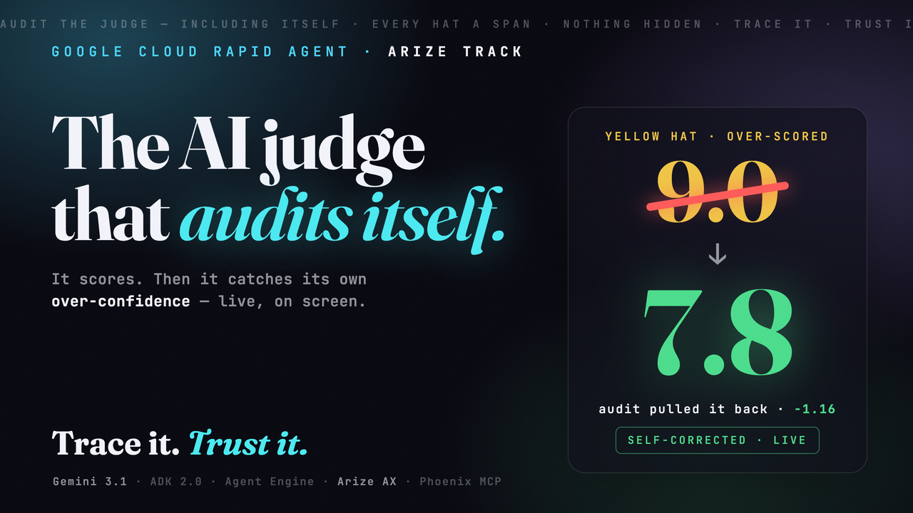
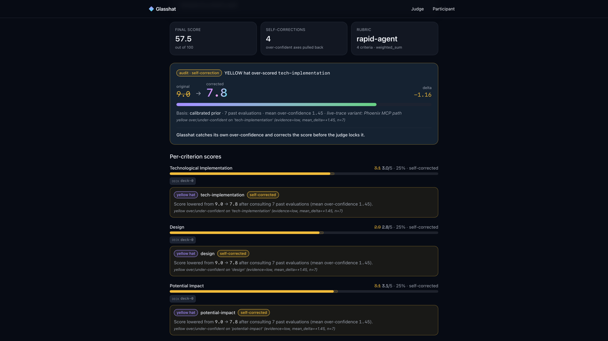
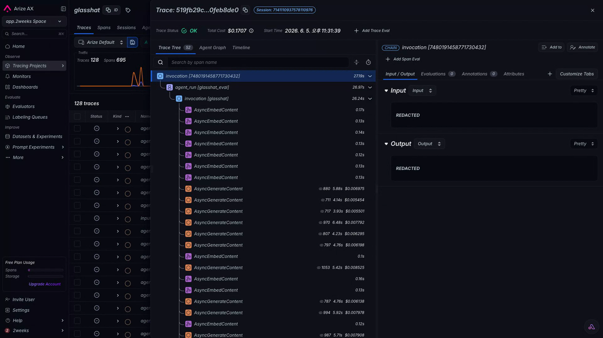
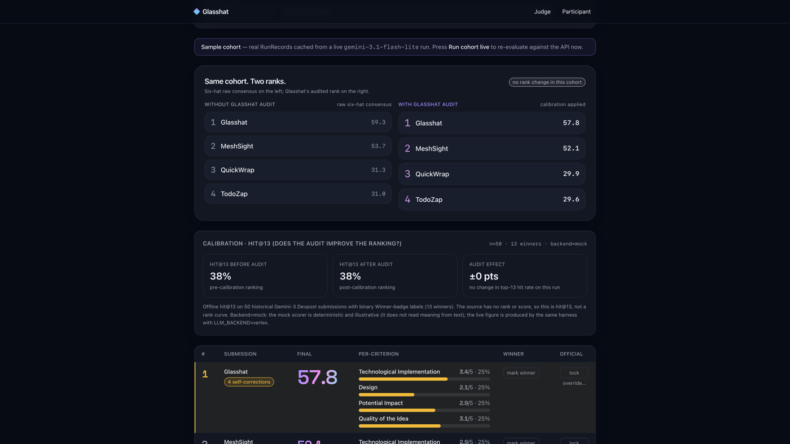
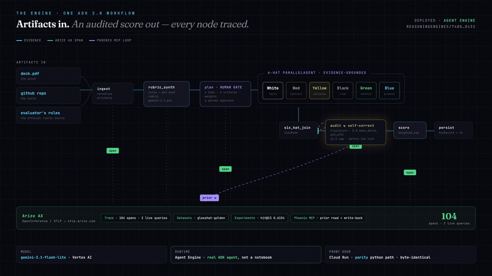

# Glasshat

### Trace it. Trust it.

[](https://github.com/Two-Weeks-Team/glasshat/actions/workflows/ci.yml) [](LICENSE) [](https://glasshat-web-o366v7tl2q-uc.a.run.app/participate) [](docs/rapid-agent-compliance.md)

> **Glasshat doesn't just judge projects — it audits the judge.**

An AI judge gives a score. Glasshat audits the **judgment itself** — live, with the math shown. It ingests a pitch deck + a GitHub repo + **the evaluator's official rules**, synthesizes a matching rubric, runs a **six-perspective Gemini panel** that grounds every sub-score in retrieved evidence, then **catches its own over-confidence and pulls the score back — `9.0 → 7.8`, before the score locks.** Every agent, every hat, and the self-correction itself opens its own **trace span in Arize AX** — so the score isn't a black box you take on faith. You open the trace and check it. *Not a chatbot.*

**Why now:** AI writes the submissions now — by the thousands — but the judging didn't change: still a confident, fast, unaccountable score, with no variance detection and no audit trail. Glasshat is that missing layer.

**Built for** the Google Cloud Rapid Agent Hackathon — **Arize track**. Gemini 3.1 (Vertex AI) · Google ADK 2.0 Workflow on Agent Engine · **Arize AX** (OpenInference/OTLP) · Phoenix MCP · Cloud Run · Apache-2.0.

---

## ▶ Demo

[](https://youtu.be/A9diFeRDybo)

**▶ [Watch the 2:52 demo on YouTube](https://youtu.be/A9diFeRDybo)** · or **try the live demo right now** ↓

| Live | URL |
|---|---|
| Web (`/judge` · `/participate`) | **https://glasshat-web-o366v7tl2q-uc.a.run.app** |
| API (`/health` · `/api/evaluate`) | **https://glasshat-api-o366v7tl2q-uc.a.run.app** |

Cloud Run · project `panelyst-hackathon` · us-central1 · `min-instances=1` (warm, so the first judge click is fast).

| the audit, live | the trace, in Arize AX | the cohort, re-ranked |
|:---:|:---:|:---:|
|  |  |  |

---

## Try it in ≈40 seconds (no install)

1. Open **[`/participate`](https://glasshat-web-o366v7tl2q-uc.a.run.app/participate)** — the Rapid Agent rubric is pre-loaded.
2. Paste any pitch text → **Preview plan** → **approve the plan** at the human gate (6 hats · 4 criteria · weights).
3. Watch the **live SSE monitor** stream `ingesting → planning → hats running → auditing`, then the **audit self-correct** beat: an over-confident YELLOW hat is pulled back — `clip(score − 0.8·mean_delta, p25, p75)`, ±2.0 cap — e.g. **`9.0 → 7.8`**, before the score locks.
4. **[`/judge`](https://glasshat-web-o366v7tl2q-uc.a.run.app/judge)** — batch rank by rubric, ordered tie-break, gate-2 override, lock. The recalibration board re-scores the cohort against the evidence and shows it honestly: on the golden set it held the top-13 (**Δ=0**) — it doesn't fake a flip.

Or hit the API directly (real Gemini 3.1 `RunRecord`):
```bash
curl -s -X POST https://glasshat-api-o366v7tl2q-uc.a.run.app/api/evaluate \
  -H 'content-type: application/json' \
  -d '{"rubric_source":{"preset_id":"rapid-agent"},"deck_text":"we built ...","mode":"judge"}'
# → RunRecord: per-criterion scores + audit_corrections (the live self-correction)
```

> **Two viewports, one engine** — `/judge` (batch rank + lock official scores) and `/participate` (single submission + iterate on the weakest axis). *Same engine. Different viewer. Different fairness.*

---

## ✅ Rapid Agent · Arize track — compliance at a glance

> Proof behind the demo. Full detail + run-it-yourself commands: **[`docs/rapid-agent-compliance.md`](docs/rapid-agent-compliance.md)** · **[`docs/evidence-matrix.md`](docs/evidence-matrix.md)**.

| Requirement | Implementation | Verify | Status |
|---|---|---|---|
| **Gemini / Vertex AI** | live `gemini-3.1-flash-lite` on the Vertex `global` endpoint (+ `gemini-3.1-pro` for rubric synthesis) | `POST <API>/api/evaluate` → real-Gemini `RunRecord` | ✅ Live |
| **Agent runtime (ADK)** | a real **ADK 2.0 graph-`Workflow`** (ingest→synth→plan→6-hat fan-out→join→audit→score) **deployed on Agent Engine**; the Cloud Run demo runs the parity-identical python path (byte-identical RunRecord+SSE) | live `…/reasoningEngines/7480191458771730432` (`stream_query` → `RunRecord`) | ✅ Live |
| **Arize partner integration** | OpenInference/OTLP → **Arize AX**: full nested trace tree + **Datasets + Experiments + Evaluator Hub**; live **hit@13 = 0.6154** | `client.spans.list(project="glasshat")`; AX experiment `glasshat-hit-at-13-gemini` | ✅ Live |
| **Phoenix MCP server** | ADK `MCPToolset` over stdio → `npx @arizeai/phoenix-mcp`; the audit reads the `glasshat-calibration` dataset **and writes each correction back, per request** | `uv run python scripts/real_e2e.py` | ✅ Live |
| **Cloud Run** | API + web, project `panelyst-hackathon`, us-central1, warm | `curl -fsS <API>/health` → 200 | ✅ Live |
| **CI / tests** | GH Actions: ruff + mypy + pytest (cov ≥ 90) · web lint/tsc/vitest/build · docker · leak gate | `uv run pytest` → **323 passed**; web **74 passed** | ✅ Green |

---

## 🔭 The Arize AX story — observability *is* the product

The Arize track asks for an agent you can **observe and evaluate**. Glasshat's whole identity is that loop — three real AX surfaces, all verifiable:

- **Trace** — the full nested span tree: `agent_run [glasshat_eval] → invocation → 48× AsyncGenerateContent + 50× AsyncEmbedContent` (the six hats' Gemini generate + embed calls). **104 spans across two live queries (~52 per eval)**, verified with `client.spans.list(project="glasshat")`. The Agent-Engine trace-drop landmine is fixed with an isolated provider (`register(set_global_tracer_provider=False)`) + the OpenInference ADK & google-genai instrumentors.
- **Datasets + Experiments** — a `glasshat-golden` dataset, a `glasshat-hit-at-13-gemini` experiment, and a `glasshat-prompt-injection` code evaluator. **hit@13 = 0.6154** on real Gemini (8 of 13 historical winners into the top-13) vs **0.3846** mock and **0.26** chance. Binary Winner-label → this is **hit@13, not a rank curve**; on this golden set the audit did not reorder the top-13 (**Δ = 0**).
- **The loop** — observe → evaluate → improve: the audit reads its calibration prior over **Phoenix MCP** and **writes every correction back**, per request (Cloud-SQL-backed Phoenix on Cloud Run). The judge gets better on its own.

Every number is captured in [`claudedocs/arize-evidence/ax-live-capture.json`](claudedocs/arize-evidence/ax-live-capture.json) (re-runnable).

> **Provenance (honest):** the nested trace is emitted by the deployed Agent-Engine resource `7480…`; the `hit@13 0.6154` comes from the experiment harness (`run_arize_experiment.py`, real Gemini over the golden set) pushed to the same AX space — the same pipeline, a different invocation, not a query of the deployed agent.

Reproduce (owner GCP/Arize creds):
```bash
# deploy the ADK 2.0 Workflow agent to Agent Engine
GOOGLE_CLOUD_PROJECT=panelyst-hackathon GOOGLE_CLOUD_QUOTA_PROJECT=panelyst-hackathon \
  uv run --with-requirements deploy/requirements-cloud.txt \
  python deploy/agent_engine_deploy.py --project=panelyst-hackathon --staging-bucket gs://glasshat-agent-staging
# run the hit@13 Arize AX experiment on real Gemini
ARIZE_SPACE_ID=… ARIZE_API_KEY=… LLM_BACKEND=gemini-enterprise \
  uv run --with-requirements deploy/requirements-cloud.txt python experiments/run_arize_experiment.py
```

---

## How it works

One **ADK 2.0 graph-Workflow**: artifacts in → an audited score out, every node a span.

[](docs/img/architecture.mp4)

<sub>▶ artifacts in, an audited score out — packets flow through every node, each one a span in Arize AX. **[Click for the full-motion version →](docs/img/architecture.mp4)**</sub>

```
deck.pdf + repo URL + rubric source
        │
   ingest (chunk + Vertex embeddings)
        │
   RubricSynthesizer   (official rules → SynthesizedRubric)        gemini-3.1-pro
        │
   BluePlanner → 6-hat panel (White/Red/Yellow/Black/Green/Blue)
        │     each hat retrieves evidence via in-code hybrid search
        │     (dense cosine + BM25 + RRF); every agent + hat is its own Arize AX span
        │
   AuditLoop   clip(score − 0.8·mean_delta, p25, p75), ±2.0 cap
        │     deployed path = PhoenixMcpConsultant: reads per-cell drift from the live
        │     glasshat-calibration dataset + writes each correction back, over MCP/stdio
        │     per request; TableConsultant (held-out prior) is the no-MCP fallback
        │
   BMADScorer → ReportAssembler   (final score in the rubric's native scale)
        │
   RunRecord  →  Firestore / SQLite / memory
```

- **Rubric-aware, not one-size-fits-all.** Each criterion maps onto a shared **BMAD vocabulary** so scores are comparable across rubrics. The Rapid Agent rule is **4 criteria × 25%** (Technological Implementation, Design, Potential Impact, Quality of the Idea), tie-break by listed order.
- **Self-correction is real math** (validated in `spikes/`), not theatre: an over-confident, low-evidence assessment is pulled back toward calibrated past evaluations.
- **No vector database.** Retrieval is **in-code** (Vertex embeddings + cosine + `rank-bm25` + RRF) over an in-memory index, rebuilt per run. No Qdrant.

### Monorepo

| Path | Role |
|---|---|
| `packages/shared` | config · llm (mock/Vertex) · retrieval (hybrid) · tracing (NoOp/Phoenix) · docstore · blobstore |
| `packages/rubric` | `SynthesizedRubric` model + JSON Schema · BMAD vocabulary · presets |
| `agents/` | engine stages: synthesizer · planner · hats · audit · scorer · report |
| `services/ingest` · `services/code-grader` | deck chunk/embed (Vertex multimodal PDF) · static repo heuristics |
| `services/pipeline-orchestrator` | `run_evaluation` end-to-end + SSE + ADK / Phoenix-MCP runtime |
| `apps/api` | FastAPI: evaluate · plan gate · SSE stream · runs · override gate |
| `apps/web` | Next.js 16: landing · `/judge` · `/participate` |

**Config-flip backends** (env): `LLM_BACKEND` (`mock`\|`vertex`\|`gemini-enterprise`) · `MONITOR_BACKEND` (`phoenix-local`\|`phoenix-cloud`\|`arize`) · `CONSULTANT_BACKEND` (`table`\|`phoenix-mcp`\|`anchor`) · `DOCSTORE_BACKEND` (`memory`\|`sqlite`\|`firestore`) · `AGENT_RUNTIME` (`python`\|`adk`). The `mock`/`memory`/`noop` backends are complete, deterministic — the whole engine runs and is tested with **zero credentials**.

---

## Reproduce

**Python engine + API — no credentials (`mock`/`memory`, deterministic):**
```bash
uv sync
uv run pytest                                   # 323 passed, mock/memory backends
uv run uvicorn glasshat.api:create_app --factory --port 8088
curl -s -X POST localhost:8088/api/evaluate \
  -H 'content-type: application/json' \
  -d '{"rubric_source":{"preset_id":"rapid-agent"},"deck_text":"we built ...","mode":"participant"}'
# deterministic (mock LLM); for real Gemini set LLM_BACKEND=vertex (+ GOOGLE_CLOUD_* — see .env.example)
```

**Web** — `cd apps/web && pnpm install && pnpm dev` (http://localhost:3000) · **Docker** — `docker compose -f infra/docker-compose.yml up --build` · **Cloud Run** — `ARIZE_SPACE_ID=<id> bash infra/deploy.sh --confirm` (or `--no-phoenix` / `--mock`).

**Verified:** CI-green (323 Python + 74 web tests, Docker build) · Lighthouse ≥ 90 on all pages (landing 92/95/96 · `/judge` 93/96/96 · `/participate` 95/96/96) · live Arize AX span per agent on every eval. More: [`docs/evidence-matrix.md`](docs/evidence-matrix.md).

---

## Honest scope

Glasshat's identity is *honest audit*, so the limits are stated, not hidden:

- **Security.** The public Cloud Run demo runs `SCORING_MODE=legacy` (historical free-text `SCORE:` extraction — a planted `SCORE: 10` can steer it) with judge endpoints open (`JUDGE_API_TOKEN` unset). The hardened path **ships and is opt-in**: `SCORING_MODE=structured` (typed JSON that quarantines the submission) + `JUDGE_API_TOKEN` + an always-on injection guard. Flipping it live is a user-gated prod redeploy.
- **Model scope.** The Cloud Run demo runs `gemini-3.1-flash-lite`; the Agent-Engine deployment runs the GA `gemini-enterprise` backend. Both share one byte-identical, parity-gated pipeline.
- **Claims.** No "un-gameable"; `hit@13 0.6154` is a binary Winner-label metric, not a rising rank curve; span counts are the measured ones (**104 across two live queries**, not per-eval).

## Lineage & no-code-reuse

A **new project created during the Contest Period** (May 5 – Jun 11, 2026), per the rules. First commit `dda8dc1` = 2026-05-13, inside the period; began as an empty scaffold (first named *Panelyst*, renamed to *Glasshat* in PR #1 — a rename in this same fresh repo, not an import). **fairthon is concept lineage only** — no source reused (`grep -rli fairthon --include='*.py' .` → no matches). Detail: [`docs/rapid-agent-compliance.md` §5](docs/rapid-agent-compliance.md#5-lineage-and-no-code-reuse).

## License

Apache-2.0 — see [`LICENSE`](LICENSE).
