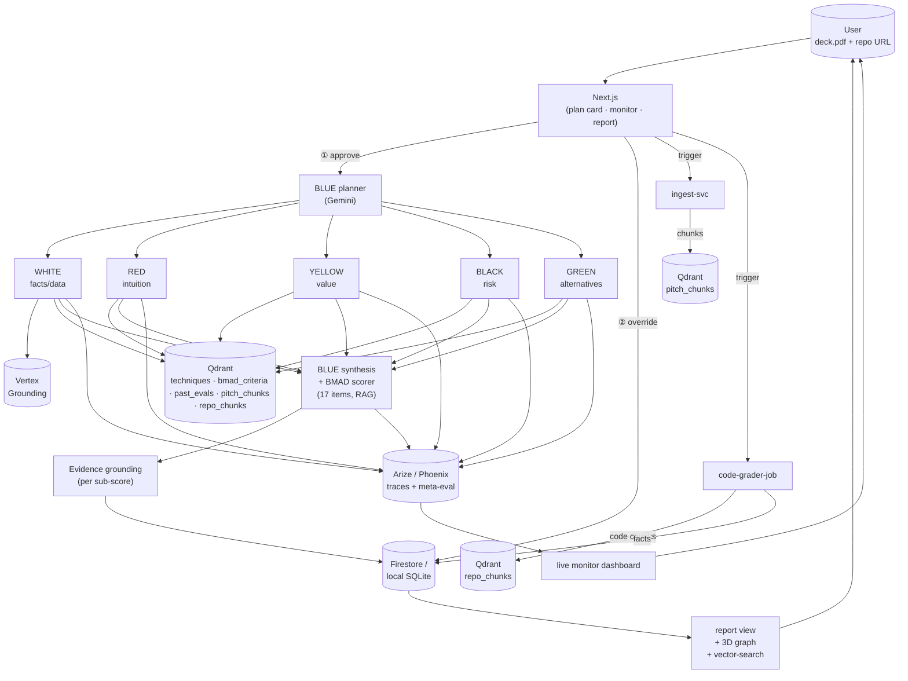
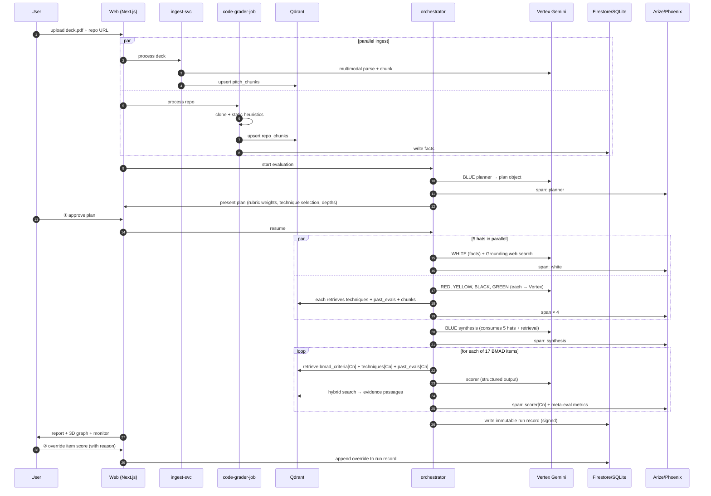

# Panelyst — Architecture

> Authoritative design document. Code references this; if the two diverge, this is the source of truth and the code is the bug.

## 1. Topology (textual diagram)

```
   USER ─ deck.pdf + repo URL ─►  [Next.js: 2 drop zones · plan card · live monitor · 3D report · vector-search page]
     ▲  ① approve plan/weights        │  (Firebase Auth)
     │  ② override score (any item)   ▼
     │
     │  ┌──────────────────────────────────────────────────────────────────────────────┐
     │  │  ingest-svc          (Cloud Run / local FastAPI)                              │
     │  │    GCS-finalize / local-fs → PDF → Gemini multimodal parse → chunk            │
     │  │    → embed → Qdrant: pitch_chunks                                             │
     │  └──────────────────────────────────────────────────────────────────────────────┘
     │                              │
     │  ┌──────────────────────────────────────────────────────────────────────────────┐
     │  │  code-grader-job     (Cloud Run Job / local CLI)                              │
     │  │    git clone (shallow) → static heuristics → README → sample code             │
     │  │    → embed code chunks → Qdrant: repo_chunks                                  │
     │  │    → facts → Firestore / local SQLite                                         │
     │  └──────────────────────────────────────────────────────────────────────────────┘
     │                              │
     │  ┌──────────────────────────────────────────────────────────────────────────────┐
     │  │  pipeline-orchestrator   (Phase 1: LangGraph local · Phase 3: Agent Builder)  │
     │  │                                                                                │
     │  │   BLUE planner ── plan object ──[① human approve]──► dispatches:               │
     │  │     ├ WHITE  (facts/data)    ─ Vertex Grounding (Google Search)                │
     │  │     ├ RED    (intuition)                                                       │
     │  │     ├ YELLOW (value/optim)              all hats query  ──► QDRANT             │
     │  │     ├ BLACK  (risk/critical)  ── must cite precedent or CVE                    │
     │  │     ├ GREEN  (alternatives)   may be ungrounded → flagged                      │
     │  │     └ BLUE-2 (synthesis)  ◄── 5 hats + precedent + evidence                    │
     │  │                                                                                │
     │  │   BMAD scorer: 17 items × structured Gemini output, RAG-augmented              │
     │  │     prompt = bmad_criteria[Cn] + relevant techniques + precedent set           │
     │  │              + grounded evidence chunks                                        │
     │  │   Evidence grounding pass: per sub-score → hybrid search → attach passages     │
     │  │                                                                                │
     │  │   ░░ EVERY hat / tool / retrieval / score  →  ARIZE / PHOENIX span ░░          │
     │  │   ░░ meta-eval: inter-hat consistency · drift-vs-precedent · groundedness ░░   │
     │  └────────────────────────────┬─────────────────────────────────────────────────┘
     │                               ▼
     │  Firestore / local SQLite  run/{id}  (immutable audit record:
     │                              input hashes, repo SHA, rubric v, technique set,
     │                              model versions, web snapshot, per-criterion
     │                              score + evidence + precedent IDs, human overrides)
     │
     ▼
   Next.js report view ◄── live MONITOR (Phoenix/Arize fairness gauges + Firestore stream)
   3D evaluation graph
   evidence drill-down (KO/EN)
```

## 2. Agent graph (mermaid)



## 3. End-to-end evaluation sequence



## 4. Phase-by-phase deployment (where each piece runs)

| Component | Phase 1 (local) | Phase 2 (mixed) | Phase 3 (cloud) | Phase 4 (Qdrant Cloud) | Phase 5 (Arize hosted) |
|---|---|---|---|---|---|
| **Web (Next.js)** | localhost:3000 | localhost | Cloud Run / Firebase Hosting | same | same |
| **ingest-svc** | local FastAPI (uvicorn :8001) | local | Cloud Run + Eventarc (GCS finalize) | same | same |
| **code-grader-job** | local Python CLI | local | Cloud Run Job (Cloud Build) | same | same |
| **pipeline-orchestrator** | LangGraph local (uvicorn :8002) | local | **Google Cloud Agent Builder** wrapping LangGraph (top agent registered) | same | same |
| **LLM** | **Vertex Gemini** (ADC from local) | Vertex | Vertex (service account) | same | same |
| **Vector** | **Qdrant local docker** (compose) | local | local | **Qdrant Cloud** | same |
| **Monitoring** | **Phoenix in-process** (`pip install arize-phoenix`) | Phoenix | Phoenix | Phoenix | **Arize hosted** (Phoenix retained for local dev) |
| **DataStore** | local SQLite (Firestore adapter) | local | **Firestore (Native)** | same | same |
| **Storage** | local FS (`./var/uploads`) | local | **Cloud Storage** | same | same |
| **Auth** | dev: anonymous / token bypass | dev | **Firebase Authentication** (Google sign-in) | same | same |
| **Web search** | **Vertex Grounding** (Phase 1 from start — needs GCP project) | Vertex | Vertex | same | same |
| **Submission**: Qdrant VSD (~Jun 1) requires Phase 1+ (Qdrant Cloud optional but stronger story); Rapid Agent (~Jun 11/12) requires Phase 3+. |

Switching layers is a **config change**, not a rewrite — see § 5 for the abstractions that enable this.

## 5. Abstractions (the "config flip" guarantees)

Every external system sits behind an interface; the implementation is chosen by env var.

| Interface | Env var | Implementations |
|---|---|---|
| `LlmClient` | `LLM_BACKEND` | `vertex` (default), `mock` (deterministic, for tests/CI), `gemma-local` (MLX, optional dev) |
| `VectorStore` | `QDRANT_URL` | docker-local (`http://localhost:6333`) → Qdrant Cloud (`https://xxx.qdrant.io`) — same client library; URL is the switch |
| `Tracer` | `MONITOR_BACKEND` | `phoenix-local` (default in dev), `arize-hosted` (prod) |
| `DocStore` | `DOCSTORE_BACKEND` | `sqlite` (local file), `firestore` (Native) |
| `BlobStore` | `BLOB_BACKEND` | `local-fs` (`./var/uploads`), `gcs` (Cloud Storage bucket) |
| `AgentRunner` | `AGENT_RUNTIME` | `langgraph-local`, `agent-builder` (wraps the same graph) |
| `WebSearch` | (hardcoded to Vertex Grounding) | Vertex Grounding with Google Search |

## 6. The two human gates (where the user stays in control)

- **Gate 1 — Approve plan.** After BLUE-planner emits the plan object (`{hats_enabled[], bmad_items_in_scope[], techniques_selected[], rubric_weights, code_grader_depth, web_search_budget}`), the Web shows it. User can adjust weights, skip a hat, change code-grader depth (lint-only / run tests / deep). Resume only after explicit approve.
- **Gate 2 — Override score.** On the final report, the user can override any of the 17 sub-scores with a reason. The run record stores both (agent's original + human override + reason + timestamp). The audit trail is the artifact.

## 7. Why "not a chatbot" (for the Qdrant VSD rubric)

- Inputs are **artifacts**, not utterances (a PDF + a URL).
- The product surface is **search + filter + table + 3D graph + monitor dashboard**, not a chat window.
- The output is a **signed structured report**, not a conversational reply.
- Vector-native UX surface: the "find similar past projects / show evidence for this score" page is search-driven, not chat-driven.

## 8. Why "an agent that does a task" (for the Rapid Agent rubric)

- It **plans** (inspectable plan object).
- It **uses tools** (PDF parser, repo/code-grader, web-search, Qdrant retrieval, Arize tracer — the partner-MCP integration; later: GitHub/GitLab if added).
- It **executes a multi-stage workflow autonomously** (the sequence in § 3).
- It **keeps the user in control** (the two human gates).
- It **produces an artifact** (a signed, evidence-grounded, precedent-anchored scored report + a live audit trail).
